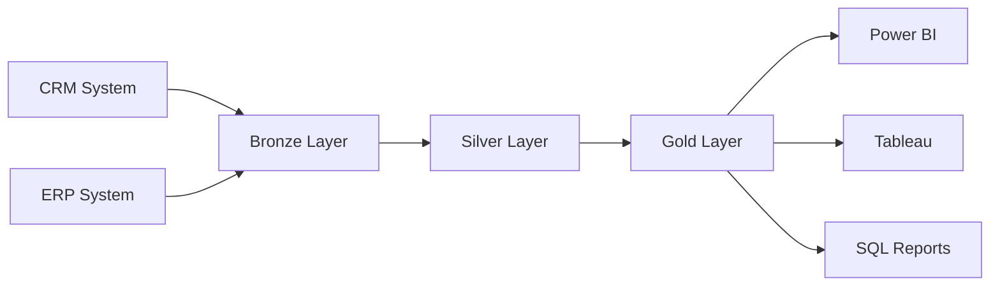

# Data Warehouse Catalog - Bronze, Silver & Gold Layers

**Project:** DatawareHouse ETL Pipeline  
**Author:** Ahmed Shittu
**Version:** 1.0  
**Last Updated:** [Date]

---

## Table of Contents

- [1. Architecture Overview](#1-architecture-overview)
- [2. Bronze Layer (Raw Data)](#2-bronze-layer-raw-data)
- [3. Silver Layer (Cleansed Data)](#3-silver-layer-cleansed-data)
- [4. Gold Layer (Analytics)](#4-gold-layer-analytics)
- [5. Data Lineage](#5-data-lineage)
- [6. Data Quality Rules](#6-data-quality-rules)
- [7. Usage Examples](#7-usage-examples)

---

## 1. Architecture Overview

### 1.1 Medallion Architecture

This data warehouse implements a **Medallion Architecture** with three layers:
```
Source Systems → Bronze Layer → Silver Layer → Gold Layer → BI/Analytics
```

| Layer | Purpose | Characteristics |
|-------|---------|----------------|
| **Bronze** | Raw data landing zone | - Minimal transformations<br>- Historical preservation<br>- May contain duplicates<br>- Source of truth |
| **Silver** | Cleansed and standardized | - Deduplication applied<br>- Data type corrections<br>- Standardized values<br>- Business rules validated |
| **Gold** | Analytics-ready | - Star schema design<br>- Denormalized<br>- Surrogate keys<br>- Optimized for queries |

### 1.2 Data Flow


### 1.3 Source Systems

| System | Module | Tables | Data Type |
|--------|--------|--------|-----------|
| **CRM** | Customer Management | CRM_Cust_Info, CRM_Prod_Info, CRM_sales_details | Customer, Product, Sales |
| **ERP** | Module AZ12 | ERP_Cust_az12 | Customer Demographics |
| **ERP** | Module AZ101 | ERP_loc_az101 | Customer Location |
| **ERP** | Module G1V2 | ERP_px_cat_g1v2 | Product Categories |

---

## 2. Bronze Layer (Raw Data)

### 2.1 Bronze.CRM_Cust_Info

**Description:** Raw customer information from CRM system

**Source:** CRM Transactional Database  
**Load Frequency:** Daily  
**Load Type:** Full Refresh  
**Primary Key:** `cust_id` (contains duplicates)

#### Schema

| Column Name | Data Type | Nullable | Description |
|-------------|-----------|----------|-------------|
| `cust_id` | INT | YES | Customer unique identifier<br>⚠️ Contains NULLs and duplicates |
| `cust_key` | NVARCHAR(50) | YES | Customer business key<br>Links to ERP systems |
| `cust_firstname` | NVARCHAR(100) | YES | Customer first name<br>⚠️ May contain spaces |
| `cust_lastname` | NVARCHAR(100) | YES | Customer last name<br>⚠️ May contain spaces |
| `cust_maritial_status` | NVARCHAR(50) | YES | Marital status<br>Raw: M, S, Married, Single |
| `cust_gender` | NVARCHAR(50) | YES | Gender<br>Raw: M, F, Male, Female |
| `cust_created_date` | DATE | YES | Account creation date |

#### Known Data Quality Issues

- ❌ Duplicate customer records (same `cust_id` with different dates)
- ❌ Inconsistent gender values (M, F, Male, Female, m, f)
- ❌ Inconsistent marital status (M, S, Married, Single)
- ❌ Leading/trailing spaces in name fields
- ❌ NULL values in `cust_id`

### 2.2 Bronze.CRM_Prod_Info

**Description:** Raw product catalog information

**Source:** CRM Product Master Database  
**Load Frequency:** Daily  
**Load Type:** Full Refresh  
**Primary Key:** `prod_id`

#### Schema

| Column Name | Data Type | Nullable | Description |
|-------------|-----------|----------|-------------|
| `prod_id` | INT | NO | Product unique identifier |
| `prod_key` | NVARCHAR(100) | YES | Product business key<br>Format: `XXXXX-YYYYYY` (Category-ProductCode) |
| `prod_name` | NVARCHAR(150) | YES | Product name |
| `prod_cost` | INT | YES | Product cost in dollars<br>⚠️ Contains NULLs |
| `prod_line` | NVARCHAR(50) | YES | Product line category<br>Raw: M, R, S, T |
| `prod_start_date` | DATE | YES | Product effective start date |
| `prod_end_date` | DATE | YES | Product effective end date<br>⚠️ Often NULL |

#### Product Line Codes

| Code | Meaning |
|------|---------|
| M | Mountain |
| R | Road |
| S | Other Sales |
| T | Touring |

#### Known Data Quality Issues

- ❌ Product key contains embedded category ID (first 5 characters)
- ❌ Product line codes not standardized
- ❌ NULL values in `prod_cost`
- ❌ Missing `prod_end_date` (requires calculation)

#### Derivations
```sql
-- Product Category ID
prod_cat_id = REPLACE(SUBSTRING(prod_key, 1, 5), '-', '_')

-- Normalized Product Key
prod_key_normalized = SUBSTRING(prod_key, 7, LEN(prod_key))

-- Product End Date
prod_end_date = DATEADD(DAY, -1, LEAD(prod_start_date) 
                OVER (PARTITION BY prod_key ORDER BY prod_start_date))
```

---

### 2.3 Bronze.CRM_sales_details

**Description:** Raw sales transaction data

**Source:** CRM Sales Transaction Database  
**Load Frequency:** Daily  
**Load Type:** Incremental  
**Primary Key:** `sls_ord_num`

#### Schema

| Column Name | Data Type | Nullable | Description |
|-------------|-----------|----------|-------------|
| `sls_ord_num` | NVARCHAR(50) | YES | Sales order number |
| `sls_prd_key` | NVARCHAR(50) | YES | Product key reference |
| `sls_cust_id` | INT | YES | Customer ID reference |
| `sls_order_dt` | INT | YES | Order date (YYYYMMDD format)<br>⚠️ May be 0 or invalid |
| `sls_ship_dt` | INT | YES | Ship date (YYYYMMDD format) |
| `sls_due_dt` | INT | YES | Due date (YYYYMMDD format) |
| `sls_sales` | INT | YES | Total sales amount<br>⚠️ May be NULL or negative |
| `sls_quantity` | INT | YES | Quantity ordered |
| `sls_price` | INT | YES | Unit price<br>⚠️ May be NULL or negative |

#### Known Data Quality Issues

- ❌ Dates stored as integers (YYYYMMDD) instead of DATE type
- ❌ Invalid date values (0, incorrect length)
- ❌ Illogical date sequences (order > ship date)
- ❌ NULL or negative values in sales/price fields
- ❌ Calculation errors: `sls_sales ≠ sls_quantity × sls_price`

#### Business Rules
```sql
-- Valid dates must be 8 digits
LEN(sls_order_dt) = 8 AND sls_order_dt > 0

-- Date sequence validation
sls_order_dt <= sls_ship_dt <= sls_due_dt

-- Sales amount calculation
IF sls_sales IS NULL OR sls_sales <= 0:
    sls_sales = sls_quantity × ABS(sls_price)

-- Price calculation
IF sls_price IS NULL:
    sls_price = sls_sales / sls_quantity
```

---

### 2.4 Bronze.ERP_Cust_az12

**Description:** Customer demographic data from ERP

**Source:** ERP Module AZ12  
**Load Frequency:** Daily  
**Load Type:** Full Refresh  
**Primary Key:** `cid`

#### Schema

| Column Name | Data Type | Nullable | Description |
|-------------|-----------|----------|-------------|
| `cid` | NVARCHAR(50) | YES | Customer ID<br>⚠️ May have 'NAS' prefix |
| `bdate` | DATE | YES | Birth date<br>⚠️ May contain future dates |
| `gen` | NVARCHAR(50) | YES | Gender<br>Raw: M, F, Male, Female |

#### Known Data Quality Issues

- ❌ Customer IDs contain invalid 'NAS' prefix
- ❌ Future birth dates (impossible/invalid)
- ❌ Inconsistent gender values

#### Cleansing Rules
```sql
-- Remove 'NAS' prefix
IF cid LIKE 'NAS%': 
    cid_clean = SUBSTRING(cid, 4, LEN(cid))

-- Validate birth date
IF bdate > GETDATE(): 
    bdate = NULL

-- Standardize gender
'F', 'Female' → 'Female'
'M', 'Male' → 'Male'
Other → 'n/a'
```

---

### 2.5 Bronze.ERP_loc_az101

**Description:** Customer location data from ERP

**Source:** ERP Module AZ101  
**Load Frequency:** Daily  
**Load Type:** Full Refresh  
**Primary Key:** `cid`

#### Schema

| Column Name | Data Type | Nullable | Description |
|-------------|-----------|----------|-------------|
| `cid` | NVARCHAR(50) | YES | Customer ID<br>⚠️ May contain hyphens |
| `cntry` | NVARCHAR(50) | YES | Country code/name<br>Raw: US, USA, DE, etc. |

#### Country Standardization

| Raw Value | Standardized |
|-----------|-------------|
| US, USA | United State |
| DE | Germany |
| Empty, NULL | n/a |
| Others | Keep original |

---

### 2.6 Bronze.ERP_px_cat_g1v2

**Description:** Product category hierarchy (Reference table)

**Source:** ERP Product Category Module  
**Load Frequency:** Weekly  
**Load Type:** Full Refresh  
**Primary Key:** `id`

#### Schema

| Column Name | Data Type | Nullable | Description |
|-------------|-----------|----------|-------------|
| `id` | NVARCHAR(50) | NO | Category unique identifier |
| `cat` | NVARCHAR(50) | YES | Category name |
| `subcat` | NVARCHAR(50) | YES | Subcategory name |
| `maintenance` | NVARCHAR(50) | YES | Maintenance indicator |

✅ **Data Quality:** Clean - no transformations required

---

## 3. Silver Layer (Cleansed Data)

### 3.1 Sliver.CRM_Cust_Info

**Description:** Cleaned and standardized customer information

**Source:** Bronze.CRM_Cust_Info  
**Transformation:** Sliver.Bulk_load stored procedure  
**Primary Key:** `cust_id` (unique, no NULLs)

#### Schema

| Column Name | Data Type | Nullable | Description | Transformation |
|-------------|-----------|----------|-------------|----------------|
| `cust_id` | INT | NO | Customer ID | Deduplicated |
| `cust_key` | NVARCHAR(50) | YES | Business key | No change |
| `cust_firstname` | NVARCHAR(100) | YES | First name | `TRIM()` applied |
| `cust_lastname` | NVARCHAR(100) | YES | Last name | `TRIM()` applied |
| `cust_maritial_status` | NVARCHAR(50) | YES | Marital status | Standardized:<br>M → Married<br>S → Single<br>Other → n/a |
| `cust_gender` | NVARCHAR(50) | YES | Gender | Standardized:<br>M → Male<br>F → Female<br>Other → n/a |
| `cust_created_date` | DATE | YES | Creation date | No change |
| `dwh_sliver_createdt` | DATETIME2(7) | NO | Load timestamp | `GETDATE()` |

#### Transformations Applied

1. **Deduplication**
```sql
   ROW_NUMBER() OVER (PARTITION BY cust_id ORDER BY cust_created_date DESC)
   -- Keeps most recent record per customer
```

2. **Text Cleaning**
```sql
   TRIM(cust_firstname)
   TRIM(cust_lastname)
```

3. **Standardization**
```sql
   -- Gender
   CASE WHEN UPPER(TRIM(cust_gender)) = 'F' THEN 'Female'
        WHEN UPPER(TRIM(cust_gender)) = 'M' THEN 'Male'
        ELSE 'n/a'
   END
```

#### Data Quality Guarantees

✅ No duplicate `cust_id` values  
✅ No NULL `cust_id` values  
✅ All names trimmed  
✅ Gender values: Male, Female, n/a only  
✅ Marital status: Married, Single, n/a only

---

### 3.2 Sliver.CRM_prod_Info

**Description:** Enriched product catalog with derived attributes

**Source:** Bronze.CRM_Prod_Info  
**Transformation:** Sliver.Bulk_load stored procedure  
**Primary Key:** `prod_id`

#### Schema

| Column Name | Data Type | Nullable | Description | Transformation |
|-------------|-----------|----------|-------------|----------------|
| `prod_id` | INT | NO | Product ID | No change |
| `prod_key` | NVARCHAR(100) | YES | Product key | Normalized (category removed) |
| `prod_cat_id` | NVARCHAR(100) | YES | Category ID | **Derived** from prod_key |
| `prod_name` | NVARCHAR(150) | YES | Product name | No change |
| `prod_cost` | INT | NO | Product cost | `ISNULL(prod_cost, 0)` |
| `prod_line` | NVARCHAR(50) | YES | Product line | Standardized |
| `prod_start_date` | DATE | YES | Start date | No change |
| `prod_end_date` | DATE | YES | End date | **Calculated** |
| `dwh_sliver_createdt` | DATETIME2(7) | NO | Load timestamp | `GETDATE()` |

#### Feature Engineering

**prod_cat_id** (Derived)
```sql
REPLACE(SUBSTRING(prod_key, 1, 5), '-', '_')
-- Example: 'CA-01' → 'CA_01'
```

**prod_end_date** (Calculated)
```sql
DATEADD(DAY, -1, LEAD(prod_start_date) 
        OVER (PARTITION BY prod_key ORDER BY prod_start_date))
-- End date = next version start date - 1
```

#### Product Line Standardization

| Code | Standardized |
|------|-------------|
| M | Mountain |
| R | Road |
| S | Other Sales |
| T | Touring |
| Other | n/a |

---

### 3.3 Sliver.CRM_sales_details

**Description:** Validated sales transactions with corrected calculations

**Source:** Bronze.CRM_sales_details  
**Transformation:** Sliver.Bulk_load stored procedure

#### Schema

| Column Name | Data Type | Nullable | Description | Transformation |
|-------------|-----------|----------|-------------|----------------|
| `sls_ord_num` | NVARCHAR(50) | YES | Order number | No change |
| `sls_prd_key` | NVARCHAR(50) | YES | Product key | No change |
| `sls_cust_id` | INT | YES | Customer ID | No change |
| `sls_order_dt` | DATE | YES | Order date | **Converted** from INT |
| `sls_ship_dt` | DATE | YES | Ship date | **Converted** from INT |
| `sls_due_dt` | DATE | YES | Due date | **Converted** from INT |
| `sls_sales` | INT | YES | Sales amount | **Calculated** if NULL/invalid |
| `sls_quantity` | INT | YES | Quantity | No change |
| `sls_price` | INT | YES | Unit price | **Calculated** if NULL, ABS() if negative |
| `dwh_sliver_createdt` | DATETIME2(7) | NO | Load timestamp | `GETDATE()` |

#### Date Conversion Logic
```sql
-- Validate and convert
CASE WHEN sls_order_dt = 0 OR LEN(sls_order_dt) <> 8 THEN NULL
     ELSE CAST(CAST(sls_order_dt AS VARCHAR) AS DATE)
END

-- Before: 20230115 (INT)
-- After:  2023-01-15 (DATE)
```

#### Financial Calculations

**Sales Amount**
```sql
CASE 
    WHEN sls_sales IS NULL AND sls_price IS NOT NULL 
        THEN sls_quantity × ABS(sls_price)
    WHEN sls_sales <= 0 AND sls_price IS NOT NULL 
        THEN sls_quantity × ABS(sls_price)
    ELSE sls_sales
END
```

**Price**
```sql
CASE 
    WHEN sls_price IS NULL AND sls_sales IS NOT NULL 
        THEN sls_sales / sls_quantity
    WHEN sls_price < 0 
        THEN ABS(sls_price)
    ELSE sls_price
END
```

---

### 3.4 Sliver.ERP_Cust_az12

**Description:** Cleaned ERP customer demographics

**Source:** Bronze.ERP_Cust_az12  
**Primary Key:** `cid`

#### Transformations

| Field | Rule |
|-------|------|
| `cid` | Remove 'NAS' prefix |
| `bdate` | Set NULL if > GETDATE() |
| `gen` | Standardize to Male/Female/n/a |

---

### 3.5 Sliver.ERP_loc_az101

**Description:** Standardized customer location data

**Source:** Bronze.ERP_loc_az101  
**Primary Key:** `cid`

#### Transformations

| Field | Rule |
|-------|------|
| `cid` | Remove all hyphens |
| `cntry` | Standardize country names |

---

### 3.6 Sliver.ERP_px_cat_g1v2

**Description:** Product category reference (pass-through)

**Source:** Bronze.ERP_px_cat_g1v2  
**Transformation:** Direct copy (no changes needed)

✅ Clean source data - no transformations required

---

## 4. Gold Layer (Analytics)

### 4.1 Star Schema Design
```
                    dim_customer
                    ┌───────────────┐
                    │ customer_key  │◄────┐
                    │ customer_id   │     │
                    │ firstname     │     │
                    │ lastname      │     │
                    │ country       │     │
                    │ gender        │     │
                    └───────────────┘     │
                                          │
                                          │
                         fact_sales       │
                    ┌─────────────────────┼─────┐
                    │ order_number        │     │
                    │ product_key     ────┼─────┤
                    │ customer_key    ────┘     │
                    │ order_date                │
                    │ sales_amount              │
                    │ quanity                   │
                    │ price                     │
                    └───────────────────────────┘
                              │
                              │
                              ▼
                    ┌───────────────┐
                    │ product_key   │
                    │ product_id    │
                    │ product_name  │
                    │ category      │
                    │ subcategory   │
                    │ cost          │
                    └───────────────┘
                    dim_product
```

### 4.2 Gold.dim_customer

**Description:** Consolidated customer dimension (360-degree view)

**Type:** Dimension Table  
**Grain:** One row per customer  
**View/Table:** View

#### Source Integration

| Source Table | Join Type | Join Condition | Purpose |
|-------------|-----------|----------------|---------|
| Sliver.CRM_Cust_Info | Base | - | Customer master data |
| Sliver.ERP_Cust_az12 | LEFT JOIN | cid = cust_key | Demographics |
| Sliver.ERP_loc_az101 | LEFT JOIN | cid = cust_key | Location |

#### Schema

| Column Name | Data Type | Description | Source | Business Logic |
|-------------|-----------|-------------|--------|----------------|
| `customer_key` | BIGINT | **Surrogate key** | Generated | `ROW_NUMBER() OVER (ORDER BY cust_id)` |
| `customer_id` | INT | Business key | CRM | `cust_id` |
| `customer_number` | NVARCHAR(50) | Cross-system ID | CRM | `cust_key` |
| `customer_firstname` | NVARCHAR(100) | First name | CRM | Trimmed |
| `customer_lastname` | NVARCHAR(100) | Last name | CRM | Trimmed |
| `country` | NVARCHAR(50) | Country | ERP Location | Standardized |
| `maritial_status` | NVARCHAR(50) | Marital status | CRM | Standardized |
| `customer_gender` | NVARCHAR(50) | Gender (reconciled) | CRM + ERP | **See logic below** |
| `customer_birthdate` | DATE | Birth date | ERP Demographics | Validated |
| `created_date` | DATE | Account creation | CRM | No change |

#### Gender Reconciliation Logic
```sql
CASE 
    WHEN cust_gender <> 'n/a' THEN cust_gender  -- CRM takes priority
    ELSE COALESCE(gen, 'n/a')                   -- Fallback to ERP
END
```

**Priority:** CRM → ERP → 'n/a'

#### Key Features

✅ Single source of truth for customer data  
✅ Complete demographic profile  
✅ Surrogate key for fact table relationships  
✅ No duplicates (one row per customer)

---

### 4.3 Gold.dim_product

**Description:** Current product dimension

**Type:** Dimension Table  
**Grain:** One row per current/active product  
**View/Table:** View

#### Source Integration

| Source Table | Join Type | Join Condition | Purpose |
|-------------|-----------|----------------|---------|
| Sliver.CRM_Prod_Info | Base | WHERE prod_end_date IS NULL | Current products only |
| Sliver.ERP_px_cat_g1v2 | LEFT JOIN | prod_cat_id = id | Category hierarchy |

#### Schema

| Column Name | Data Type | Description | Source | Notes |
|-------------|-----------|-------------|--------|-------|
| `product_key` | BIGINT | **Surrogate key** | Generated | `ROW_NUMBER() OVER (ORDER BY prod_start_date, prod_key)` |
| `product_id` | INT | Business key | CRM | `prod_id` |
| `product_number` | NVARCHAR(100) | Product code | CRM | Normalized `prod_key` |
| `product_name` | NVARCHAR(150) | Product name | CRM | |
| `category_id` | NVARCHAR(100) | Category ID | CRM | Derived |
| `category` | NVARCHAR(50) | Category name | ERP | Top level |
| `subcategory` | NVARCHAR(50) | Subcategory | ERP | Detail level |
| `maintenance` | NVARCHAR(50) | Maintenance flag | ERP | |
| `cost` | INT | Product cost | CRM | NULLs = 0 |
| `prodcut_line` | NVARCHAR(50) | Product line | CRM | Standardized |
| `start_date_c` | DATE | Start date | CRM | |

#### Important Filter
```sql
WHERE prod_end_date IS NULL
```

⚠️ **Only current/active products included** - historical versions excluded

#### Key Features

✅ Current products only (no history)  
✅ Category hierarchy included  
✅ Surrogate key for relationships  
✅ No duplicates

---

### 4.4 Gold.fact_sales

**Description:** Sales transaction fact table

**Type:** Fact Table  
**Grain:** One row per sales transaction  
**View/Table:** View

#### Source Integration

| Source Table | Join Type | Join Condition | Purpose |
|-------------|-----------|----------------|---------|
| Sliver.CRM_sales_details | Base | - | Transaction details |
| Gold.dim_customer | LEFT JOIN | sls_cust_id = customer_id | Customer key lookup |
| Gold.dim_product | LEFT JOIN | sls_prd_key = product_number | Product key lookup |

#### Schema

| Column Name | Data Type | Type | Description | Additivity |
|-------------|-----------|------|-------------|-----------|
| `order_number` | NVARCHAR(50) | Attribute | Order number | - |
| `product_key` | BIGINT | **Foreign Key** | → dim_product | - |
| `customer_key` | BIGINT | **Foreign Key** | → dim_customer | - |
| `order_date` | DATE | Attribute | Order date | Non-additive |
| `shipping_date` | DATE | Attribute | Ship date | Non-additive |
| `due_date` | DATE | Attribute | Due date | Non-additive |
| `sales_amount` | INT | **Measure** | Revenue | ✅ Additive |
| `quanity` | INT | **Measure** | Units sold | ✅ Additive |
| `price` | INT | **Measure** | Unit price | ⚠️ Semi-additive (AVG) |

#### Measures & Metrics

**Additive Measures** (can SUM)
- `sales_amount` - Total revenue
- `quanity` - Total units

**Semi-Additive Measures** (use AVG)
- `price` - Average or weighted average

**Common Calculations**
```sql
-- Total Revenue
SUM(sales_amount)

-- Total Units
SUM(quanity)

-- Average Unit Price
AVG(price)  
-- or: SUM(sales_amount) / SUM(quanity)

-- Order Count
COUNT(DISTINCT order_number)

-- Average Order Value
SUM(sales_amount) / COUNT(DISTINCT order_number)
```

#### Orphaned Records

⚠️ **LEFT JOINs may result in NULL surrogate keys**

- **NULL customer_key:** Customer not in dim_customer (data quality issue)
- **NULL product_key:** Product inactive (prod_end_date IS NOT NULL) - **expected**

**Monitoring Query:**
```sql
SELECT 
    COUNT(*) AS total_transactions,
    SUM(CASE WHEN customer_key IS NULL THEN 1 ELSE 0 END) AS null_customer,
    SUM(CASE WHEN product_key IS NULL THEN 1 ELSE 0 END) AS null_product
FROM Gold.fact_sales;
```

---

## 5. Data Lineage

### 5.1 Transformation Flow
```
┌─────────────────────────┐
│   Bronze Layer          │
│   (Raw Data)            │
└───────────┬─────────────┘
            │
            │ ETL: Sliver.Bulk_load
            │
            │ ┌─────────────────────────────┐
            │ │ Transformations:            │
            │ │ • Deduplication             │
            │ │ • TRIM spaces               │
            │ │ • Standardize values        │
            │ │ • Calculate fields          │
            │ │ • Validate dates            │
            │ │ • Correct calculations      │
            │ └─────────────────────────────┘
            │
            ▼
┌─────────────────────────┐
│   Silver Layer          │
│   (Cleansed Data)       │
└───────────┬─────────────┘
            │
            │ Views: dim_*, fact_*
            │
            │ ┌─────────────────────────────┐
            │ │ Integration:                │
            │ │ • Join multiple tables      │
            │ │ • Generate surrogate keys   │
            │ │ • Reconcile data            │
            │ │ • Denormalize               │
            │ └─────────────────────────────┘
            │
            ▼
┌─────────────────────────┐
│   Gold Layer            │
│   (Analytics-Ready)     │
└─────────────────────────┘
```

### 5.2 Table-Level Lineage

#### Customer Dimension
```
Bronze.CRM_Cust_Info ─────┐
                          │
Bronze.ERP_Cust_az12 ─────┼──> Sliver.CRM_Cust_Info ─────┐
                          │                               │
Bronze.ERP_loc_az101 ─────┘    Sliver.ERP_Cust_az12 ─────┼──> Gold.dim_customer
                                                          │
                               Sliver.ERP_loc_az101 ──────┘
```

#### Product Dimension
```
Bronze.CRM_Prod_Info ────┐
                         │
Bronze.ERP_px_cat_g1v2 ──┴──> Sliver.CRM_Prod_Info ─────┐
                                                         │
                              Sliver.ERP_px_cat_g1v2 ────┴──> Gold.dim_product
```

#### Sales Fact
```
Bronze.CRM_sales_details ──> Sliver.CRM_sales_details ──┐
                                                        │
Gold.dim_customer ──────────────────────────────────────┼──> Gold.fact_sales
                                                        │
Gold.dim_product ───────────────────────────────────────┘
```

### 5.3 Key Transformations by Layer

| Layer | Bronze → Silver | Silver → Gold |
|-------|----------------|---------------|
| **Customer** | • Deduplicate by cust_id<br>• TRIM names<br>• Standardize gender/marital<br>• Remove 'NAS' prefix<br>• Validate birthdates | • Join CRM + ERP data<br>• Reconcile gender<br>• Generate surrogate key<br>• Rename columns |
| **Product** | • Derive prod_cat_id<br>• Normalize prod_key<br>• Standardize prod_line<br>• Calculate end_date<br>• Replace NULL cost | • Filter current products<br>• Join category hierarchy<br>• Generate surrogate key<br>• Rename columns |
| **Sales** | • Convert date INT→DATE<br>• Validate dates<br>• Calculate sales amount<br>• Calculate price<br>• Apply ABS() to negatives | • Lookup surrogate keys<br>• Join dimensions<br>• Rename columns |

---

## 6. Data Quality Rules

### 6.1 Critical Rules (Must Pass)

#### Primary Key Integrity
```sql
-- ✅ No NULL values in primary keys
SELECT COUNT(*) FROM Gold.dim_customer WHERE customer_key IS NULL;
-- Expected: 0

-- ✅ No duplicate primary keys
SELECT customer_key, COUNT(*) 
FROM Gold.dim_customer 
GROUP BY customer_key 
HAVING COUNT(*) > 1;
-- Expected: 0 rows
```

#### Referential Integrity
```sql
-- ✅ All foreign keys reference valid parent records
SELECT COUNT(*) 
FROM Gold.fact_sales f
LEFT JOIN Gold.dim_customer c ON f.customer_key = c.customer_key
WHERE f.customer_key IS NOT NULL AND c.customer_key IS NULL;
-- Expected: 0 (no orphaned keys)
```

#### Date Logic
```sql
-- ✅ No future birthdates
SELECT COUNT(*) 
FROM Silver.ERP_Cust_az12 
WHERE bdate > GETDATE();
-- Expected: 0

-- ✅ Logical date sequences
SELECT COUNT(*) 
FROM Silver.CRM_sales_details
WHERE sls_order_dt > sls_ship_dt;
-- Expected: 0
```

#### Financial Calculations
```sql
-- ✅ No negative prices
SELECT COUNT(*) 
FROM Silver.CRM_sales_details 
WHERE sls_price < 0;
-- Expected: 0

-- ✅ Sales = Quantity × Price (within tolerance)
SELECT COUNT(*) 
FROM Silver.CRM_sales_details
WHERE ABS(sls_sales - (sls_quantity * sls_price)) > 1;
-- Expected: 0
```

### 6.2 High Priority Rules (Should Pass)

#### Data Standardization

| Field | Valid Values | Check Query |
|-------|-------------|-------------|
| Gender | Male, Female, n/a | `SELECT DISTINCT customer_gender FROM Gold.dim_customer` |
| Marital Status | Married, Single, n/a | `SELECT DISTINCT maritial_status FROM Gold.dim_customer` |
| Product Line | Mountain, Road, Other Sales, Touring, n/a | `SELECT DISTINCT prodcut_line FROM Gold.dim_product` |
| Country | Full names (United State, Germany, etc.) | `SELECT DISTINCT country FROM Gold.dim_customer` |

#### Text Formatting
```sql
-- ✅ No leading/trailing spaces
SELECT COUNT(*) FROM Silver.CRM_Cust_Info
WHERE cust_firstname <> TRIM(cust_firstname);
-- Expected: 0
```

### 6.3 Quality Check Schedule

| Check Type | Frequency | Automation |
|-----------|-----------|------------|
| Primary key integrity | After each load | Automated alert |
| Referential integrity | Daily | Automated monitoring |
| Data standardization | Weekly | Manual review |
| Completeness metrics | Monthly | Dashboard |

### 6.4 Data Quality Monitoring Dashboard

**Recommended KPIs:**

1. **Completeness**
   - % of customers with birthdate
   - % of customers with country
   - % of products with category

2. **Validity**
   - Count of invalid dates
   - Count of negative amounts
   - Count of orphaned records

3. **Consistency**
   - Gender match rate (CRM vs ERP)
   - Duplicate customer rate
   - Product version count

4. **Timeliness**
   - Last Bronze load timestamp
   - Last Silver load timestamp
   - Data freshness (hours)

---

## 7. Usage Examples

### 7.1 Customer Analytics

#### Top Customers by Revenue
```sql
SELECT 
    c.customer_firstname + ' ' + c.customer_lastname AS customer_name,
    c.country,
    SUM(f.sales_amount) AS total_revenue,
    SUM(f.quanity) AS total_units,
    COUNT(DISTINCT f.order_number) AS order_count,
    AVG(f.sales_amount) AS avg_order_value
FROM Gold.fact_sales f
INNER JOIN Gold.dim_customer c ON f.customer_key = c.customer_key
GROUP BY c.customer_firstname, c.customer_lastname, c.country
ORDER BY total_revenue DESC
LIMIT 100;
```

#### Customer Segmentation by Country
```sql
SELECT 
    c.country,
    COUNT(DISTINCT c.customer_key) AS customer_count,
    SUM(f.sales_amount) AS total_revenue,
    AVG(f.sales_amount) AS avg_revenue_per_customer
FROM Gold.dim_customer c
LEFT JOIN Gold.fact_sales f ON c.customer_key = f.customer_key
GROUP BY c.country
ORDER BY total_revenue DESC;
```

#### Customer Lifetime Value
```sql
WITH CustomerMetrics AS (
    SELECT 
        c.customer_key,
        c.customer_firstname + ' ' + c.customer_lastname AS customer_name,
        MIN(f.order_date) AS first_purchase,
        MAX(f.order_date) AS last_purchase,
        DATEDIFF(DAY, MIN(f.order_date), MAX(f.order_date)) AS customer_tenure_days,
        SUM(f.sales_amount) AS lifetime_value,
        COUNT(DISTINCT f.order_number) AS total_orders
    FROM Gold.dim_customer c
    INNER JOIN Gold.fact_sales f ON c.customer_key = f.customer_key
    GROUP BY c.customer_key, c.customer_firstname, c.customer_lastname
)
SELECT 
    customer_name,
    lifetime_value,
    total_orders,
    lifetime_value / NULLIF(total_orders, 0) AS avg_order_value,
    customer_tenure_days,
    CASE 
        WHEN customer_tenure_days <= 90 THEN 'New'
        WHEN customer_tenure_days <= 365 THEN 'Growing'
        ELSE 'Established'
    END AS customer_segment
FROM CustomerMetrics
ORDER BY lifetime_value DESC;
```

### 7.2 Product Analytics

#### Best Selling Products
```sql
SELECT 
    p.product_name,
    p.category,
    p.subcategory,
    p.prodcut_line,
    SUM(f.sales_amount) AS total_revenue,
    SUM(f.quanity) AS units_sold,
    COUNT(DISTINCT f.order_number) AS order_count,
    SUM(f.sales_amount) / NULLIF(SUM(f.quanity), 0) AS avg_unit_price
FROM Gold.fact_sales f
INNER JOIN Gold.dim_product p ON f.product_key = p.product_key
GROUP BY p.product_name, p.category, p.subcategory, p.prodcut_line
ORDER BY total_revenue DESC
LIMIT 50;
```

#### Product Profitability Analysis
```sql
SELECT 
    p.product_name,
    p.category,
    p.cost,
    SUM(f.quanity) AS units_sold,
    SUM(f.sales_amount) AS revenue,
    SUM(f.quanity) * p.cost AS total_cost,
    SUM(f.sales_amount) - (SUM(f.quanity) * p.cost) AS gross_profit,
    (SUM(f.sales_amount) - (SUM(f.quanity) * p.cost)) / NULLIF(SUM(f.sales_amount), 0) * 100 AS profit_margin_pct
FROM Gold.fact_sales f
INNER JOIN Gold.dim_product p ON f.product_key = p.product_key
GROUP BY p.product_name, p.category, p.cost
ORDER BY gross_profit DESC;
```

#### Category Performance
```sql
SELECT 
    p.category,
    p.subcategory,
    COUNT(DISTINCT p.product_key) AS product_count,
    SUM(f.sales_amount) AS total_revenue,
    SUM(f.quanity) AS units_sold,
    AVG(f.price) AS avg_selling_price
FROM Gold.dim_product p
LEFT JOIN Gold.fact_sales f ON p.product_key = f.product_key
GROUP BY p.category, p.subcategory
ORDER BY total_revenue DESC;
```

### 7.3 Time-Series Analytics

#### Monthly Sales Trend
```sql
SELECT 
    YEAR(order_date) AS year,
    MONTH(order_date) AS month,
    SUM(sales_amount) AS monthly_revenue,
    SUM(quanity) AS monthly_units,
    COUNT(DISTINCT order_number) AS order_count,
    AVG(sales_amount) AS avg_order_value
FROM Gold.fact_sales
WHERE order_date IS NOT NULL
GROUP BY YEAR(order_date), MONTH(order_date)
ORDER BY year, month;
```

#### Year-over-Year Growth
```sql
WITH MonthlyMetrics AS (
    SELECT 
        YEAR(order_date) AS year,
        MONTH(order_date) AS month,
        SUM(sales_amount) AS revenue
    FROM Gold.fact_sales
    WHERE order_date IS NOT NULL
    GROUP BY YEAR(order_date), MONTH(order_date)
)
SELECT 
    current.year,
    current.month,
    current.revenue AS current_year_revenue,
    prior.revenue AS prior_year_revenue,
    current.revenue - prior.revenue AS revenue_growth,
    (current.revenue - prior.revenue) / NULLIF(prior.revenue, 0) * 100 AS growth_pct
FROM MonthlyMetrics current
LEFT JOIN MonthlyMetrics prior 
    ON current.month = prior.month 
    AND current.year = prior.year + 1
ORDER BY current.year, current.month;
```

#### Seasonal Analysis
```sql
SELECT 
    DATEPART(QUARTER, order_date) AS quarter,
    MONTH(order_date) AS month,
    AVG(sales_amount) AS avg_monthly_revenue,
    SUM(sales_amount) AS total_revenue
FROM Gold.fact_sales
WHERE order_date IS NOT NULL
GROUP BY DATEPART(QUARTER, order_date), MONTH(order_date)
ORDER BY quarter, month;
```

### 7.4 Operational Metrics

#### Fulfillment Performance
```sql
SELECT 
    AVG(DATEDIFF(DAY, order_date, shipping_date)) AS avg_fulfillment_days,
    MIN(DATEDIFF(DAY, order_date, shipping_date)) AS min_fulfillment_days,
    MAX(DATEDIFF(DAY, order_date, shipping_date)) AS max_fulfillment_days,
    COUNT(CASE WHEN shipping_date <= due_date THEN 1 END) AS on_time_deliveries,
    COUNT(*) AS total_orders,
    COUNT(CASE WHEN shipping_date <= due_date THEN 1 END) * 100.0 / COUNT(*) AS on_time_pct
FROM Gold.fact_sales
WHERE order_date IS NOT NULL 
  AND shipping_date IS NOT NULL;
```

#### Order Status Dashboard
```sql
SELECT 
    COUNT(*) AS total_orders,
    COUNT(CASE WHEN shipping_date IS NULL THEN 1 END) AS pending_shipment,
    COUNT(CASE WHEN shipping_date IS NOT NULL THEN 1 END) AS shipped,
    COUNT(CASE WHEN shipping_date > due_date THEN 1 END) AS late_deliveries,
    AVG(sales_amount) AS avg_order_value,
    SUM(sales_amount) AS total_revenue
FROM Gold.fact_sales
WHERE order_date >= DATEADD(DAY, -30, GETDATE());
```

### 7.5 Cross-Dimensional Analysis

#### Sales by Country and Product Line
```sql
SELECT 
    c.country,
    p.prodcut_line,
    COUNT(DISTINCT c.customer_key) AS customer_count,
    SUM(f.sales_amount) AS revenue,
    SUM(f.quanity) AS units,
    AVG(f.price) AS avg_price
FROM Gold.fact_sales f
INNER JOIN Gold.dim_customer c ON f.customer_key = c.customer_key
INNER JOIN Gold.dim_product p ON f.product_key = p.product_key
GROUP BY c.country, p.prodcut_line
ORDER BY revenue DESC;
```

#### Customer Demographics vs Purchase Behavior
```sql
SELECT 
    c.customer_gender,
    c.maritial_status,
    COUNT(DISTINCT c.customer_key) AS customer_count,
    SUM(f.sales_amount) AS total_revenue,
    AVG(f.sales_amount) AS avg_order_value,
    SUM(f.quanity) AS units_purchased
FROM Gold.dim_customer c
INNER JOIN Gold.fact_sales f ON c.customer_key = f.customer_key
WHERE c.customer_gender <> 'n/a'
  AND c.maritial_status <> 'n/a'
GROUP BY c.customer_gender, c.maritial_status
ORDER BY total_revenue DESC;
```

---

## 8. ETL Process Documentation

### 8.1 ETL Schedule

| Process | Frequency | Time | Duration | Dependencies |
|---------|-----------|------|----------|--------------|
| Bronze Load - CRM | Daily | 2:00 AM | ~30 min | Source system available |
| Bronze Load - ERP | Daily | 2:30 AM | ~15 min | Source system available |
| Silver Load | Daily | 3:00 AM | ~45 min | Bronze load complete |
| Gold Refresh | On-demand | - | Instant | Silver views (auto-refresh) |

### 8.2 Load Process Flow
```
┌──────────────────┐
│  Source Systems  │
│  • CRM Database  │
│  • ERP Database  │
└────────┬─────────┘
         │
         │ Extract (SSIS/Script)
         ▼
┌──────────────────┐
│  Bronze Layer    │
│  (Raw Landing)   │
└────────┬─────────┘
         │
         │ Transform (Sliver.Bulk_load)
         ▼
┌──────────────────┐
│  Silver Layer    │
│  (Cleansed)      │
└────────┬─────────┘
         │
         │ Integrate (Views)
         ▼
┌──────────────────┐
│  Gold Layer      │
│  (Analytics)     │
└────────┬─────────┘
         │
         │ Consume
         ▼
┌──────────────────┐
│  BI Tools        │
│  • Power BI      │
│  • Tableau       │
│  • SQL Reports   │
└──────────────────┘
```

### 8.3 Key Stored Procedures

#### Sliver.Bulk_load

**Purpose:** Transform Bronze → Silver  
**Type:** Stored Procedure  
**Schedule:** Daily at 3:00 AM

**Operations:**
1. Truncate all Silver tables
2. Transform CRM_Cust_Info (deduplicate, standardize)
3. Transform CRM_Prod_Info (derive, enrich)
4. Transform CRM_sales_details (validate, calculate)
5. Transform ERP_Cust_az12 (cleanse)
6. Transform ERP_loc_az101 (standardize)
7. Transform ERP_px_cat_g1v2 (pass-through)
8. Log row counts and execution time

**Error Handling:**
- TRY-CATCH block
- Detailed error logging
- Transaction rollback on failure

### 8.4 Monitoring & Alerts

**Critical Alerts:**
- Bronze load failure
- Silver load failure
- Data quality check failures
- Execution time > 2x baseline

**Daily Checks:**
- Row count validation
- NULL surrogate key count
- Date freshness
- Referential integrity

---

## 9. Glossary

### Business Terms

| Term | Definition |
|------|------------|
| **Customer Key** | Unique identifier for customers across CRM and ERP systems |
| **Product Line** | High-level product categorization (Mountain, Road, Touring, Other Sales) |
| **Sales Amount** | Total revenue for a transaction (quantity × price) |
| **Marital Status** | Customer's marital status (Married, Single, n/a) |
| **Fulfillment Time** | Days between order date and ship date |

### Technical Terms

| Term | Definition |
|------|------------|
| **Surrogate Key** | System-generated sequential integer key for dimension tables |
| **Grain** | Level of detail in a fact table (e.g., one row per transaction) |
| **Deduplication** | Removing duplicate records based on business rules |
| **Star Schema** | Dimensional model with central fact table and surrounding dimensions |
| **Additive Measure** | Metric that can be summed across all dimensions (e.g., revenue) |
| **Semi-Additive** | Metric that can be summed across some dimensions but not all (e.g., price) |
| **Type 1 SCD** | Slowly Changing Dimension that overwrites historical values |

### Acronyms

| Acronym | Meaning |
|---------|---------|
| **CRM** | Customer Relationship Management |
| **ERP** | Enterprise Resource Planning |
| **ETL** | Extract, Transform, Load |
| **BI** | Business Intelligence |
| **SCD** | Slowly Changing Dimension |
| **FK** | Foreign Key |
| **PK** | Primary Key |

---

## 10. References & Resources

### Documentation

- [Data Warehouse Setup Guide](./docs/setup-guide.md)
- [ETL Process Documentation](./docs/etl-process.md)
- [BI Dashboard Specifications](./docs/dashboards/)

### Scripts

- [Bronze Layer DDL](./scripts/01_Bronze_Layer_Tables.sql)
- [Silver Layer DDL](./scripts/02_Silver_Layer_Tables.sql)
- [Gold Layer Views](./scripts/03_Gold_Layer_Views.sql)
- [ETL Procedure](./scripts/04_Sliver_Bulk_Load.sql)
- [Quality Checks](./scripts/05_Data_Quality_Checks.sql)

### Contact Information

| Role | Team/Person | Email |
|------|-------------|-------|
| **Technical Owner** | Data Engineering Team | dataeng@company.com |
| **Business Owner** | Analytics Team | analytics@company.com |
| **Support** | BI Team | bi-support@company.com |

---

## Appendix A: Change Log

| Date | Version | Author | Changes |
|------|---------|--------|---------|
| 2024-02-07 | 1.0 | [Your Name] | Initial data catalog creation |

---

## Appendix B: Future Enhancements

### Planned Features

1. **Historical Tracking**
   - Implement Type 2 SCD for customer dimension
   - Track product version history in Gold layer
   - Maintain price change history

2. **Additional Dimensions**
   - Date dimension for advanced time intelligence
   - Geography dimension with hierarchies
   - Product hierarchy dimension

3. **Performance Optimization**
   - Materialize Gold views as tables
   - Add indexes on foreign keys
   - Partition large fact tables by date

4. **Data Quality**
   - Automated quality monitoring dashboard
   - Real-time alerts for critical failures
   - Data lineage visualization tool

5. **Advanced Analytics**
   - Customer cohort analysis
   - Product recommendation engine
   - Predictive sales forecasting

---

**End of Data Catalog**

---

*For questions, issues, or contributions, please contact the Data Engineering team or open an issue in this repository.*
